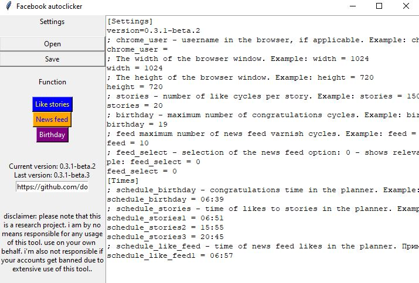

# Facebook Auto Liker (English, Russian)

### version v0.3.1-beta.4
Facebook likes feeds, likes stories, send message birthday.

Автоматический лайкер новостной ленты, историй и отправка поздравлений с днем рождения.

### Функции RU
* Лайки ленты друзей
* Лайки историй
* Поздравления с днем рождения
* Встроенный планировщик
* Информирование через телеграм бота
* Запуск из командной строки (например для запуска через планировщик)

### Functions EN
* Likes friends feed
* Likes stories
* Send Happy Birthday Messages
* Run from the command line

### Install
 Python: 
```
pip install selenium
pip install pyTelegramBotAPI
pip install schedule
```
Windows:
```
downloads .exe files
```
## Настройки

#### Настройка параметров
Настройка осуществляется без графического интерфейса в тестовом формате путем редактивания файла **setting.ini** через текстовый редактор или во встроенном текстовым редакторе.

**chrome_user** - имя пользователя в браузере, если используется. Пример:
```
chrome_user = andrey
```
**width** - ширина окна браузера. Пример:
```
width = 1024
```
**height** - высота окна браузера. Пример:
```
height = 720
```
**stories** - количество циклов лайков в сториес  (не рекомендуется большое значение). Пример:
```
stories = 150
```
**birthday** - максимальное количество циклов поздравлений (не рекомендуется больше 20). Пример:
```
birthday = 19
```
**feed** максимальное количество циклов лаков ленты новостей (не рекомендуется большое значение). Пример:
```
feed = 300
```
**token** - токен телеграм бота выдается при созаднии бота: BotFather (https://t.me/BotFather) Пример:
```
token = 1387036342:AAGm4QWD5vUjH7FgQbejmz1jelfvh1WUDQI
```
**botid** - ваш ID в телеграме (не бота). Можно узнать отправив сообщение боту: getmyid_bot (https://t.me/getmyid_bot). Пример:
```
botid = 1251879074
```
#### Настройка планировщика 
**schedule_birthday** - время поздравлений в планировщике. Пример:
```
schedule_birthday = 10:00
```
**schedule_stories** - время лайков в сториес в планировщике. Пример:
```
schedule_stories1 = 10:00
```
**schedule_like_feed** - время лайков новостной ленты в планировщике. Пример:
```
schedule_like_feed = 15:00
```
#### Настройка поздравлений с днем рождения 
Настройка осуществляется путем редактирования файла **birthday.txt**. Одно поздравление в одну строку, без переносов. Пример:
```
Поздравляю с днем рождения!
Мои поздравления с днем рождения!
Поздравляю с днюшечкой!
Мои поздравления с днюшечкой
Поздравляю с Днем Рождения!
С Днем Рождения тебя!
Прими мои поздравления с днем рождения!
```
#### Командная строка
Лайки новостной ленты:
```
python FacebookRU.py feed
FacebookRU.exe feed
```
Лайки историй:
```
python FacebookRU.py story
FacebookRU.exe story
```
Поздравления с днем рождения:
```
python FacebookRU.py birthday
FacebookRU.exe birthday
```
### Compatibility
* Windows 10, 2019
* Python 3.7+
* Selenium 3.4.0+
* Chrome driver current test release 84.0.4147.30 (for other version: [download driver](https://chromedriver.chromium.org/))
* Chrome current test release 84.0+ (chrome://settings/help)
* Facebook language: Russian, English
* Switch to New Facebook design

## Author
* **Skobeev Maksim** - [DoEvent](https://github.com/doevent/)


## License
This project is licensed under the [MIT](https://en.wikipedia.org/wiki/MIT_License) License
